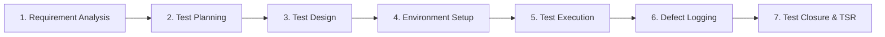

# 🛒 Manual Testing Portfolio: NopCommerce Registration Page

 

---

## 📌 Executive Summary

This repository presents an **end-to-end Manual Testing Project** performed on the **NopCommerce Demo Registration Page**. 

The project strictly follows the **Software Testing Life Cycle (STLC)** industry standards — encompassing **Requirement Analysis (SRS)**, **Test Planning**, **Test Scenario & Test Case Design**, **Test Execution & Result Logging**, **Defect Tracking**, and **Test Closure (TSR)**.

### 🌐 Application Under Test (AUT)
- **Application:** NopCommerce Demo Store
- **Module:** User Registration Module
- **AUT URL:** [https://demo.nopcommerce.com/register](https://demo.nopcommerce.com/register)
- **Environment:** QA / Staging Test Environment

 

  
  
<em>Figure 1: Application Under Test (AUT) — NopCommerce Registration Interface</em>

---

## 📊 Test Execution Dashboard & Key Metrics

| Metric | Details |
|---|---|
| **Total Test Scenarios** | **14** Scenarios |
| **Total Test Cases Executed** | **32** Test Cases |
| **Passed Test Cases** | **29** (✅ 90.6%) |
| **Failed Test Cases** | **03** (❌ 9.4%) |
| **Blocked / Untested** | **00** (0%) |
| **Total Defects Logged** | **04** Defects |
| **Defect Severity Breakdown** | 0 Critical, 0 Major, 4 Minor |
| **Defect Priority Breakdown** | 4 Medium |
| **Test Execution Status** | **100% Completed** |

---

## 🛠️ Testing Toolkit & Environment

### Tools & Technologies
- **Documentation & Reporting:** Microsoft Word, Google Docs (IEEE 829 Standard)
- **Test Design & Defect Logging:** Microsoft Excel (Structured Test Suites & Execution Matrices)
- **Version Control:** Git & GitHub
- **Browsers Tested:** Google Chrome (v128+), Microsoft Edge (v127+)
- **Operating Systems:** Windows 10 / Windows 11 (64-bit)
- **Screen Resolutions:** 1920x1080 (Desktop), Responsive Tablet & Mobile viewports

### Test Design Techniques Used
- **Equivalence Class Partitioning (ECP):** Segregating valid and invalid input sets for Name, Email, and Password fields.
- **Boundary Value Analysis (BVA):** Validating minimum, maximum, and extreme character lengths (e.g., password lengths, name boundary lengths).
- **Positive & Negative Testing:** Verifying expected happy-path journeys alongside robust error handling on improper inputs.
- **Error Guessing & Edge Case Analysis:** Testing special characters, whitespace handling, missing required fields, and SQL injection strings.

---

## 📂 Project Deliverables & Documentation

All project documentation is maintained in both **editable (DOCX/XLSX)** and **portable (PDF)** formats for full transparency:

| # | Document Name | Description | Formats Available |
|---|---|---|---|
| **01** | **Software Requirements Specification (SRS)** | IEEE-standard specification outlining functional & non-functional requirements of the registration module. | [📄 PDF](./Software%20Requirements%20Specification(SRS).pdf) \| [📝 DOCX](./Software%20Requirements%20Specification(SRS).docx) |
| **02** | **Test Plan Document** | Comprehensive testing strategy, scope, entry/exit criteria, schedules, roles, and risk assessment. | [📄 PDF](./Test%20Plan%20Document.pdf) \| [📝 DOCX](./Test%20Plan%20Document.docx) |
| **03** | **Test Scenarios** | High-level test conditions mapped to business specifications (14 scenarios). | [📄 PDF](./Test%20Scenarios.pdf) \| [📊 XLSX](./Test%20Scenarios.xlsx) |
| **04** | **Test Cases** | Low-level test cases containing detailed steps, pre-conditions, test data, and expected results (32 test cases). | [📄 PDF](./Test%20Case.pdf) \| [📊 XLSX](./Test%20Case.xlsx) |
| **05** | **Test Execution Report** | Detailed execution log tracking Actual vs. Expected results, pass/fail status, and execution dates. | [📄 PDF](./Test%20Execution%20Document.pdf) \| [📊 XLSX](./Test%20Execution%20Document.xlsx) |
| **06** | **Defect Report** | Formal defect log detailing bug IDs, reproduction steps, severity, priority, and screenshots. | [📄 PDF](./Defect%20Report.pdf) \| [📊 XLSX](./Defect%20Report.xlsx) |
| **07** | **Test Summary Report (TSR)** | Final project sign-off document summarizing execution coverage, defect density, metrics, and recommendations. | [📄 PDF](./Test%20Summary%20Report.pdf) \| [📝 DOCX](./Test%20Summary%20Report.docx) |

---

## 🔄 Software Testing Life Cycle (STLC) Workflow

1. **Requirement Analysis:** Analyzed functional requirements from the NopCommerce Register module to derive testable conditions.
2. **Test Planning:** Outlined objectives, test strategies, scope boundaries (in-scope vs. out-of-scope), resource allocation, and deliverables.
3. **Test Design:** Authored 14 detailed test scenarios and expanded them into 32 test cases applying ECP, BVA, and negative test cases.
4. **Environment Setup:** Prepared test environments (Chrome, Edge) with clean sessions, cookies reset, and test data sheets.
5. **Test Execution:** Ran each test case manually, documented actual observations, captured proof of failure, and marked status.
6. **Defect Reporting:** Logged 4 identified defects with step-by-step reproduction guidelines, expected vs actual behavior, severity, and priority.
7. **Test Closure:** Evaluated exit criteria, compiled key findings, calculated pass percentages, and published the final **Test Summary Report**.

---

## 🧪 Sample Test Cases Snapshot

Here is an excerpt illustrating the structure and thoroughness of the test suite:

| Test Case ID | Scenario | Test Steps | Test Data | Expected Result | Actual Result | Status |
|---|---|---|---|---|---|---|
| **TC_REG_01** | Verify page load | 1. Navigate to AUT URL 2. Observe page layout | Valid URL | Registration page loads completely with all fields visible | Page opened successfully | **PASS** ✅ |
| **TC_REG_02** | Mandatory field validation | 1. Leave all fields empty 2. Click 'Register' | None | Validation errors appear for all mandatory fields | Error messages displayed properly | **PASS** ✅ |
| **TC_REG_05** | First Name numeric input | 1. Enter numeric values in First Name 2. Fill valid details 3. Click 'Register' | `12345` | System should show validation error for alphabetic input only | Field accepts numeric input without validation | **FAIL** ❌ |
| **TC_REG_12** | Valid Registration | 1. Fill all valid details 2. Click 'Register' | Valid unique credentials | Registration successful message displayed | Account created successfully | **PASS** ✅ |
| **TC_REG_18** | Password Confirmation mismatch | 1. Enter password 2. Enter different confirm password 3. Click 'Register' | Pwd: `Pass@123` Confirm: `Pass@456` | Error message: "The password and confirmation password do not match." | Error displayed correctly | **PASS** ✅ |

*(Full suite of 32 test cases available in [Test Case.xlsx](./Test%20Case.xlsx))*

---

## 🐞 Defect Summary Log

During the test execution phase, **4 defects** were detected and formally documented:

| Bug ID | Defect Title / Description | Severity | Priority | Status | Impact |
|---|---|---|---|---|---|
| **BUG_01** | First Name field accepts numeric and special characters | Minor | Medium | `Open` | Data integrity; first names should be strictly alphabetic. |
| **BUG_02** | Last Name field accepts numeric and special characters | Minor | Medium | `Open` | Data integrity; last names should be strictly alphabetic. |
| **BUG_03** | Password field allows maximum length beyond standard recommendation (up to 64 chars without indicator) | Minor | Medium | `Open` | UX feedback on password complexity limits. |
| **BUG_04** | Password accepted without enforcing alphanumeric + special character policy | Minor | Medium | `Open` | Security weakness; weak passwords may be set by users. |

*(Detailed bug descriptions with reproduction steps available in [Defect Report.xlsx](./Defect%20Report.xlsx))*

---

## 💡 Key Findings & Recommendations

### Key Observations:
- **Core Functionality:** Successful registration with valid data works seamlessly; confirmation page and newsletter integration behave properly.
- **Mandatory Fields:** Asterisk indicators and blank field validations operate as intended.
- **Data Integrity Gaps:** Input sanitization and format validation for name fields (rejecting numbers/symbols) should be implemented on client and server sides.
- **Password Policy:** Enforcing a strong password requirement (minimum 8 characters, alphanumeric + uppercase + special character) is strongly recommended for improved user security.

---

## 👩‍💻 Author

<table border="0">
  <tr>
    <td width="100" align="center">
      
    </td>
    <td>
      <strong>Sanskriti Bhardwaj</strong> 
      <em>Aspiring QA Engineer & Manual / Automation Tester</em>  
      💼 <strong>LinkedIn:</strong> <a href="https://www.linkedin.com/in/sanskriti-bhardwaj01/">linkedin.com/in/sanskriti-bhardwaj01</a> 
      🐙 <strong>GitHub:</strong> <a href="https://github.com/Sanskriti-Bhardwaj">github.com/Sanskriti-Bhardwaj</a>
    </td>
  </tr>
</table>

---

## ⭐️ Feedback & Contributions

Contributions, issues, and feature requests are welcome! If you found this project helpful or insightful for manual testing documentation, feel free to **Star ⭐ this repository**!
